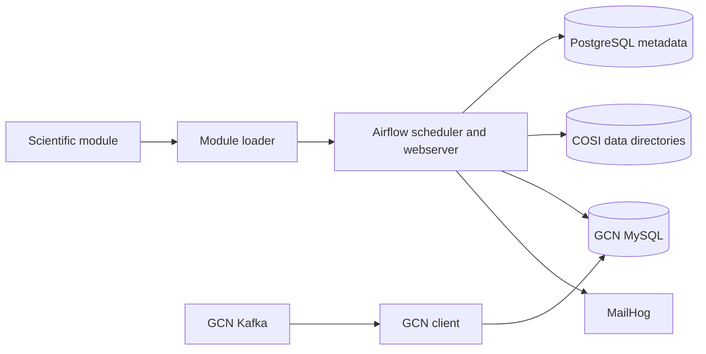

# Architecture overview

COSIflow separates orchestration from scientific pipeline implementations.
The core Compose stack owns scheduling, state, operator-facing UI, and GCN
transport. Modules such as FasTP contribute DAG and pipeline code through the
module loader.

## Services

| Service | Responsibility | Host exposure |
| --- | --- | --- |
| `airflow-init` | Database migration, secret re-encryption, administrator synchronization, and RBAC provisioning | none; exits after successful initialization |
| `airflow` | Airflow webserver and scheduler | loopback UI port only |
| `postgres` | Airflow metadata database | none |
| `gcn-client` | Supervised inbound and outbound GCN workers | none |
| `gcn-mysql` | Durable GCN inbox, outbox, attempts, heartbeats, and lifecycle records | none |
| `mailhog` | Local SMTP capture and development UI | loopback SMTP and UI ports |

Airflow and the GCN client share the internal application and database networks
as required. The database network is marked internal. The Airflow container is
not granted access to a Docker socket.

## Code and data boundaries

- Core DAGs are supplied by modules, not copied into this repository.
- Module DAG and pipeline directories are exposed to Airflow through
  `.cfmodule` symlinks.
- Scientific dependencies may run in managed Python environments selected by
  module configuration.
- `COSIDAG` provides orchestration mechanics; a module owns scientific task
  definitions and outputs.
- Airflow tasks query or enqueue GCN records through MySQL. Kafka connections
  remain inside the GCN client service.

Read [COSIflow modules](modules.md) for loading and runtime selection, and the
[COSIDAG reference](../reference/cosidag.md) for the workflow contract.
