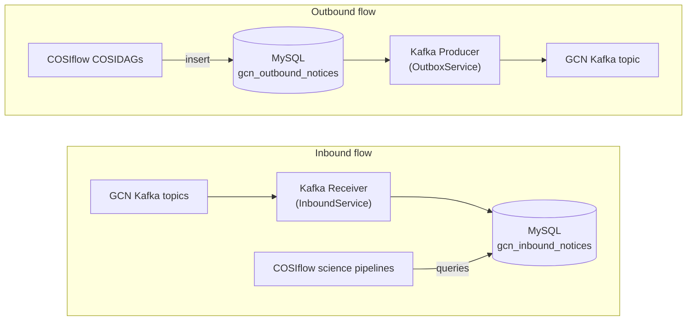

# COSIflow GCN Client Prototype

This directory contains the COSIflow prototype for exchanging machine-readable
alerts with NASA's [General Coordinates Network (GCN)](https://gcn.nasa.gov/).
It connects a Kafka consumer and producer to a dedicated MySQL database, giving
COSIflow pipelines a durable inbox and outbox instead of requiring scientific
DAG tasks to communicate with Kafka directly.

The prototype is deliberately safe by default: inbound consumption is enabled,
but outbound Kafka publication is disabled, publication runs are dry-runs, and
only test topics and COSI notices whose `alert_tense` is `test` or `injection`
are accepted.

## Architecture



Both workers run in the `gcn-client` service. `python -m app.main run` starts
the receiver and outbox worker in separate threads. The MySQL server runs as the
`gcn-mysql` service and is intentionally separate from Airflow's PostgreSQL
database. Both services are defined in
[`env/docker-compose.yaml`](https://github.com/cositools/cosiflow/blob/dev-review/env/docker-compose.yaml).

### Kafka receiver

The receiver in
[`gcn-client/app/services/inbound_service.py`](https://github.com/cositools/cosiflow/blob/dev-review/gcn-client/app/services/inbound_service.py):

1. creates a `gcn_kafka.Consumer` with `GCN_CLIENT_ID`,
   `GCN_CLIENT_SECRET`, and `GCN_CONSUMER_GROUP_ID`;
2. subscribes to the comma-separated topics in `GCN_CONSUMER_TOPICS`;
3. reads each Kafka message and records its topic, partition, offset, key, and
   timestamp;
4. parses JSON notices, extracts a summary from VOEvent XML, or stores
   unsupported text/raw payloads without discarding them;
5. normalizes common fields such as mission, instrument, event time, sky
   coordinates, classification, and HEALPix URL;
6. inserts the result into `gcn_inbound_notices`.

Automatic Kafka commits are disabled. When `GCN_CONSUMER_COMMIT=true`, the
worker commits a message synchronously only after the database insert returns.
If the insert or commit fails, it closes and recreates the consumer after a
bounded exponential backoff. A redelivered message is safe because the inbox
uniqueness constraint uses its Kafka topic, partition, and offset.

The `(topic, kafka_partition, kafka_offset)` unique key makes the receiver
idempotent when Kafka redelivers a message. COSI notices that identify the COSI
schema are validated; notices from other missions remain available with
`validation_status = 'not_applicable'`.

### Kafka producer

The producer path in
[`gcn-client/app/services/outbox_service.py`](https://github.com/cositools/cosiflow/blob/dev-review/gcn-client/app/services/outbox_service.py)
implements a
transactional-outbox-style workflow:

1. a pipeline or the prototype CLI inserts a notice into
   `gcn_outbound_notices`;
2. the outbox worker claims queued rows in priority/creation order using
   `FOR UPDATE SKIP LOCKED`;
3. it validates the COSI JSON schema and applies the prototype safety guards;
4. it records every delivery attempt in `gcn_delivery_attempts`;
5. in dry-run mode it marks the row `dry_run_published` without contacting
   Kafka; when explicitly enabled, it serializes the JSON and publishes it with
   `gcn_kafka.Producer`;
6. transient publication failures are re-queued with a persisted, bounded
   exponential backoff until `max_attempts` is reached;
7. malformed or permanently invalid rows are recorded as failed and unlocked
   without stopping later rows in the batch;
8. expired worker locks are recovered after the configured timeout.

The outbox `idempotency_key` prevents the same pipeline task/result from
creating duplicate logical notices.

## MySQL schema

The schema in
[`gcn-client/app/db/schema.sql`](https://github.com/cositools/cosiflow/blob/dev-review/gcn-client/app/db/schema.sql)
contains **five tables**:

| Table | Role | Important data |
| --- | --- | --- |
| `gcn_inbound_notices` | Durable inbox for alerts received from GCN | Kafka position, original payload, parsed JSON, normalized event fields, parsing and validation status |
| `gcn_outbound_notices` | Durable outbox for COSI alerts awaiting publication | Topic, payload, schema/validation state, DAG provenance, priority, retry state, idempotency key, publication result |
| `gcn_delivery_attempts` | Audit trail for every outbox attempt | Attempt number, dry-run flag, Kafka metadata, error class/message, start and finish times |
| `gcn_client_heartbeats` | Last-known worker health/status | Component name (`inbound` or `outbox`), status, update time, and JSON details |
| `gcn_client_lifecycle_events` | Application lifecycle audit | Start, stopping, and component-failure events with timestamps |

`gcn_inbound_notices` preserves `raw_payload` even if parsing fails and also
stores indexed columns used by science queries. `gcn_outbound_notices` keeps
both the complete JSON payload and pipeline provenance such as `dag_run_id`,
`task_id`, `source_product_dir`, and `source_config_path`.

The client initializes these tables automatically when
`GCN_INIT_DB_ON_START=true`, which is the default.

## Configuration

Configuration is read from environment variables in
[`gcn-client/app/config.py`](https://github.com/cositools/cosiflow/blob/dev-review/gcn-client/app/config.py).
The most important groups are:

- `GCN_CLIENT_ID`, `GCN_CLIENT_SECRET`, `GCN_DOMAIN`: GCN Kafka
  authentication;
- `GCN_CONSUMER_TOPICS`, `GCN_CONSUMER_GROUP_ID`,
  `GCN_CONSUMER_ENABLED`: inbound subscriptions;
- `GCN_PRODUCER_ENABLED`, `GCN_DRY_RUN`, `GCN_TOPIC_ALLOWLIST`,
  `GCN_REQUIRE_TEST_TOPICS`: outbound publication and safety controls;
- `GCN_DB_HOST`, `GCN_DB_PORT`, `GCN_DB_NAME`, `GCN_DB_USER`,
  `GCN_DB_PASSWORD`: MySQL connection;
- `GCN_SCHEMA_ROOT`, `GCN_COSI_ALERT_SCHEMA`: local schema validation.

Worker resilience uses these optional settings:

| Variable | Default | Purpose |
| --- | ---: | --- |
| `GCN_WORKER_BACKOFF_INITIAL_SECONDS` | `1` | First delay after a worker-loop failure |
| `GCN_WORKER_BACKOFF_MAX_SECONDS` | `30` | Maximum worker-loop delay |
| `GCN_WORKER_BACKOFF_JITTER_RATIO` | `0.2` | Random spread applied to retry delays |
| `GCN_WORKER_FAILURE_BUDGET` | `5` | Consecutive loop or watchdog failures before process exit |
| `GCN_OUTBOX_RETRY_INITIAL_SECONDS` | `5` | First persisted delivery retry delay |
| `GCN_OUTBOX_RETRY_MAX_SECONDS` | `300` | Maximum persisted delivery retry delay |
| `GCN_OUTBOX_LOCK_TIMEOUT_SECONDS` | `300` | Age after which an abandoned outbox lock is recovered |
| `GCN_HEARTBEAT_DEGRADED_SECONDS` | `30` | Age that makes the external healthcheck degraded |
| `GCN_HEARTBEAT_OFFLINE_SECONDS` | `90` | Age that makes a worker offline |
| `GCN_WATCHDOG_INTERVAL_SECONDS` | `5` | Main-process watchdog interval |
| `GCN_WATCHDOG_START_GRACE_SECONDS` | `30` | Startup grace before watchdog checks |

The maximum worker backoff must remain below the offline heartbeat threshold.
The outbox lock timeout must exceed the expected maximum duration of one
publish attempt.

Add your own required credentials to
`cosiflow/env/.env`:

```dotenv
GCN_CLIENT_ID=<your-gcn-client-id>
GCN_CLIENT_SECRET=<your-gcn-client-secret>
```

The same file normally contains the local Airflow and database passwords; do
not replace its other entries. Never commit it or paste the secret into
documentation or logs. See the
[configuration guide](../getting-started/configuration.md#required-secrets)
for the complete local-secret configuration.

## Run the prototype

From `cosiflow/env`:

```bash
docker compose build gcn-client
docker compose up -d gcn-mysql gcn-client
docker compose ps
docker compose logs -f gcn-client
```

The default configuration consumes the topics listed in
`GCN_CONSUMER_TOPICS`. Missing Kafka or database credentials are fatal before
the client opens a connection. Transient failures are retried locally up to a
configured failure budget. An exhausted budget, an unexpected worker return,
or a stale-worker watchdog failure exits the process non-zero. The container
healthcheck uses application heartbeats and Compose uses `unless-stopped`, so
Docker restarts the failed process until an operator explicitly stops it.
Airflow only displays this state; it has no lifecycle endpoint or Docker
access.

Outbox publication is at-least-once across the Kafka/MySQL boundary. If Kafka
accepts a notice and the following MySQL success update fails, stale-lock
recovery may publish the notice again. Consumers must use the notice identity
or payload identity to tolerate that ambiguity; the implementation does not
claim distributed exactly-once delivery.

Use `./gcn-lifecycle.sh start|stop|restart|status` from `cosiflow/env` for audited local
lifecycle operations. Shared deployments use the platform orchestrator and its
native audit trail.

### Queue a sample COSI alert

[`gcn-client/examples/cosi-alert.test.json`](https://github.com/cositools/cosiflow/blob/dev-review/gcn-client/examples/cosi-alert.test.json)
is an example
initial COSI alert. It contains event timing, sky localization, classification,
rate/fluence information, and the set of triggered BGO shields.

Queue it from the running client container:

```bash
docker compose exec gcn-client \
  python -m app.main queue-outbound \
  --file /app/examples/cosi-alert.test.json \
  --topic gcn.notices.cosi.test.alert
```

The command prints the outbox row ID. The continuously running outbox worker
will process it; with the default safety settings its final status is
`dry_run_published`.

To run one processing cycle explicitly:

```bash
docker compose exec gcn-client python -m app.main process-outbox-once
```

Inspect the result:

```bash
docker compose exec gcn-mysql sh -lc \
  'mysql -u"$MYSQL_USER" -p"$MYSQL_PASSWORD" "$MYSQL_DATABASE" -e "
  SELECT id, created_at, status, topic, mission, instrument, event_name,
         attempts_count, published_at, last_error
  FROM gcn_outbound_notices
  ORDER BY id DESC
  LIMIT 10;
  "'
```

### Inspect received alerts

To check the newest alerts received from other missions:

```bash
docker compose exec gcn-mysql sh -lc \
  'mysql -u"$MYSQL_USER" -p"$MYSQL_PASSWORD" "$MYSQL_DATABASE" -e "
  SELECT id, received_at, topic, mission, instrument, event_name,
         COALESCE(trigger_time, isotime, alert_datetime, received_at) AS event_time,
         parse_status, validation_status
  FROM gcn_inbound_notices
  ORDER BY received_at DESC
  LIMIT 20;
  "'
```

To inspect the complete payload for one row:

```sql
SELECT id, topic, raw_payload, payload_json, validation_errors
FROM gcn_inbound_notices
WHERE id = <notice-id>;
```

The Fast Transient Analysis Pipeline also provides
`gcn.query.query_relevant_grb_notices`, which queries this table in a science
time window and returns normalized long/short GRB notice summaries. Database
errors are returned as structured `unavailable` results so that an unavailable
GCN database does not fail the science task.

### Inject an alert without Kafka

For parser/database testing, inject a local payload into the inbox:

```bash
docker compose exec gcn-client \
  python -m app.main inject-inbound \
  --file /app/examples/cosi-alert.test.json \
  --topic gcn.notices.cosi.test.alert \
  --source injection
```

## Publishing outside dry-run mode

Real publication is intentionally not the default. Before setting
`GCN_PRODUCER_ENABLED=true` and `GCN_DRY_RUN=false`, the COSI team must:

1. coordinate the COSI topic prefix and schema with the GCN team;
2. obtain credentials authorized for the GCN mission-producer scope;
3. use only the approved topic and a versioned production schema;
4. update the allowlist and test the exact payload on approved test topics;
5. review delivery attempts and failure/retry behavior.

See the official GCN guides for
[Kafka client setup](https://gcn.nasa.gov/docs/client) and
[new notice producers](https://gcn.nasa.gov/docs/notices/producers).

## CLI reference

Run commands inside the `gcn-client` container with
`python -m app.main <command>`:

| Command | Purpose |
| --- | --- |
| `init-db` | Create or verify the five MySQL tables |
| `run` | Run the inbound and outbox workers |
| `run-inbound` | Run only the Kafka receiver |
| `run-outbox` | Run only the outbox worker |
| `consume-inbound-once` | Consume for a bounded time/message count |
| `inject-inbound` | Parse a local file and insert it into the inbox |
| `queue-outbound` | Validate a JSON file and insert it into the outbox |
| `process-outbox-once` | Claim and process one outbox batch |
